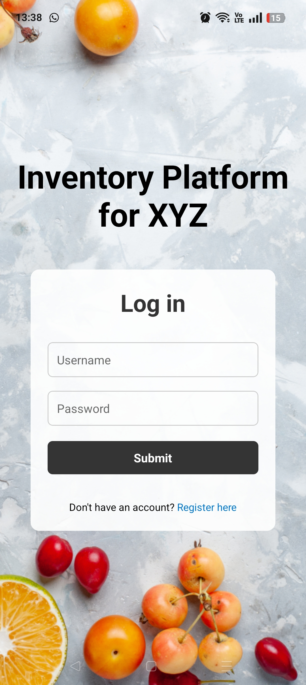
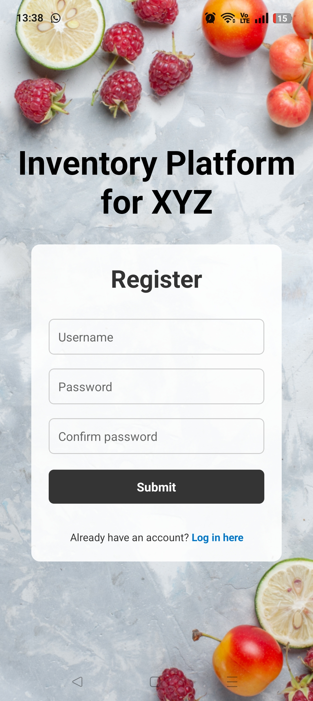
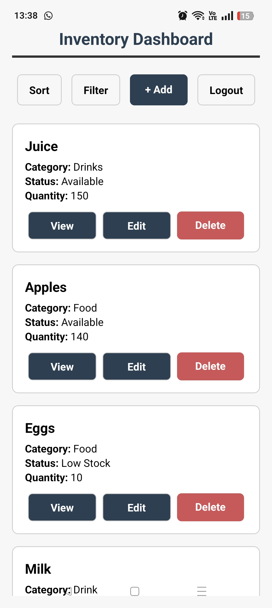
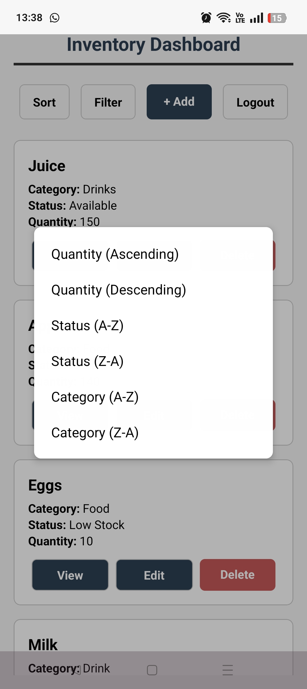
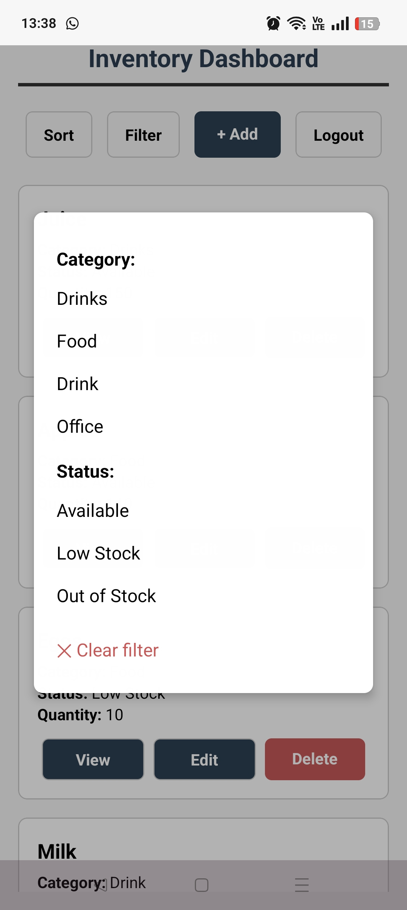
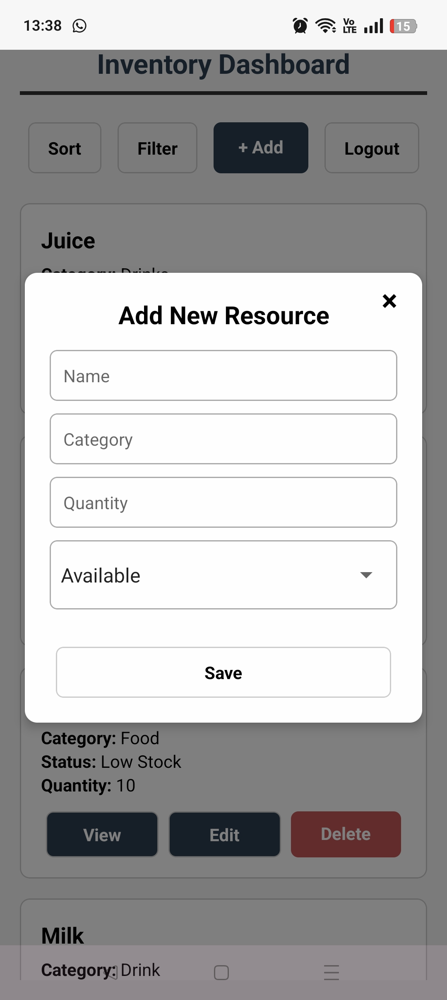
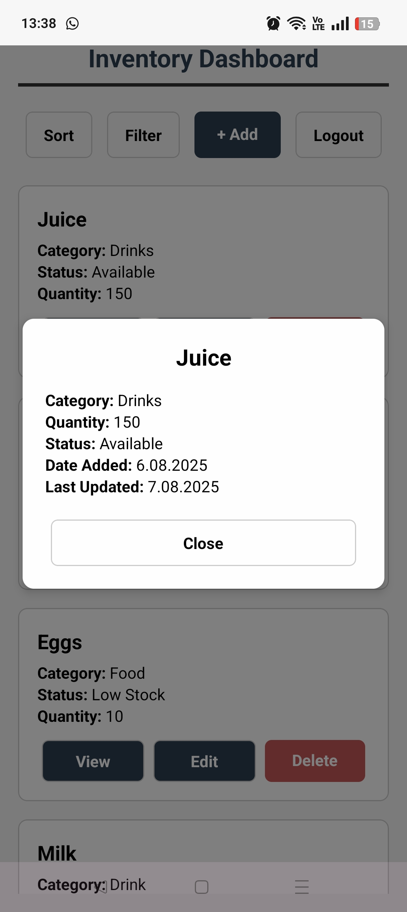
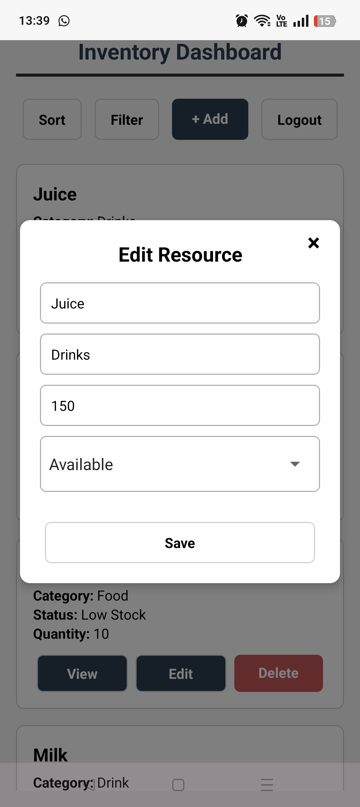
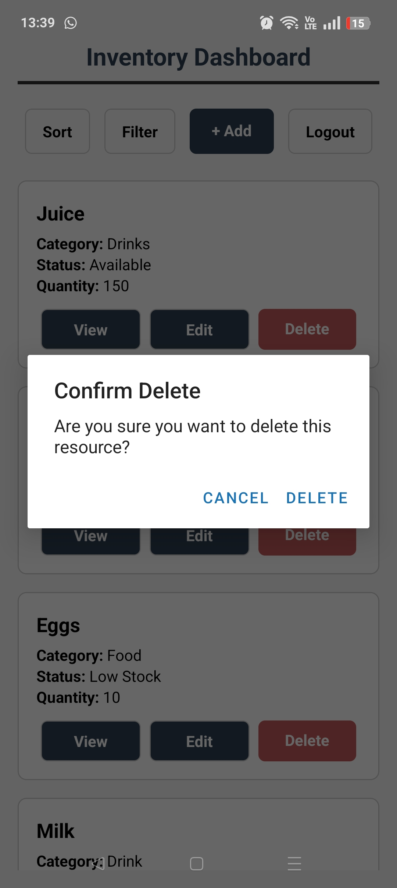

# Fullstack inventory platform
This is recruitment task to develop a fullstack inventory platform that allows users to manage resources of any type, with features for user authentication. Technologies used: **Python3**, **FastAPI**, **React**.


## Objective
The platform includes the following deliverables:

- Design mocks in **Figma** (directory: *design*);
- Backend with API (**Python 3** + **FastAPI**) (directory: *backend*);
- Frontend application (**React**)  (directory: *frontend*);
- Documentation in **Swagger**;
- Mobile application in **React Native** (directory: *mobile*).


## Description

- The following features: **user registration**, **login**, and **logout** were implemented using **JWT (JSON Web Token)** authentication;
- Information is stored in relational database **SQLite**;
- Users can **add**, **view**, **edit**, and **delete** resources;
- **Filtering** and **sorting** options are included for resource listings.


## Web application
### How to run the project locally
Prerequisites:

```bash
> node -v
> v18.19.1

> npm -v
> 9.2.0
```

To run the application, type in the first terminal:
```bash
npm create vite@4.1.0
npm -i
cd frontend/
npm run dev
```

In another terminal execute:
```bash
cd backend/
python3 -m venv venv
source venv/bin/activate
pip3 install -r requirements.txt
uvicorn main:app --reload
```

The application will be available at: `http://localhost:5137`.

The backend API documentation (Swagger) will be available at: `http://localhost:8000/docs`.


### Visualization of the web application

Login screen:


Registration screen:


Dashboard screen:


After clicking on 'sort' button, the dropdown list appears. The user can sort products by quantity (ascending/descending), status and category.


After clicking on 'filter' button, the dropdown list appears. The user can filter products by category and status.


There are features such as adding new resource, viewing details, editing and deleting resources.


## Mobile application
### How to run project locally
Prerequisites:

```bash
npx expo install react-native
npx expo install expo-router
npm install -g expo-cli
npm install @react-navigation/native
npx expo install react-native-screens react-native-safe-area-context react-native-gesture-handler react-native-reanimated
npm install @react-navigation/native-stack
npx expo install @react-native-async-storage/async-storage
npm install @react-native-picker/picker
```
The following versions were used:

```bash
> node -v
> v18.19.1

> npm -v
> 9.2.0
```

Also it is needed to have Expo Go application on your mobile.

Execute in the first terminal:
```bash
cd mobile/
npx expo start
```

In another terminal write:
```bash
cd backend/
uvicorn main:app --reload --host 0.0.0.0 --port 8000
```

Please adjust correct IP address in files: *register.tsx*, *index.tsx* and *dashboard.tsx*.

### Visualization of the mobile application

<p align="center">
  
  
  
</p>

<p align="center">
  
  
  
</p>

<p align="center">
  
  
  
</p>
