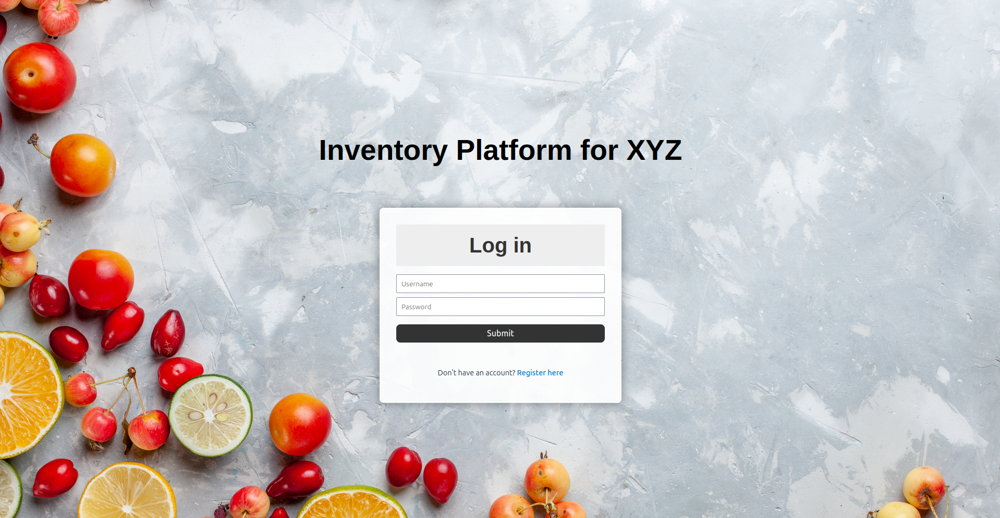

# Fullstack inventory platform
This is recruitment task to develop a fullstack inventory platform that allows users to manage resources of any type, with features for user authentication. Technologies used: **Python3**, **FastAPI**, **React**.


## Objective
The platform includes the following deliverables:

- Design mocks in **Figma** (directory: *design*);
- Backend with API (**Python 3** + **FastAPI**) (directory: *backend*);
- Frontend application (**React**)  (directory: *frontend*);
- Documentation in **Swagger**.


## Description

- The following features: **user registration**, **login**, and **logout** were implemented using **JWT (JSON Web Token)** authentication;
- Information is stored in relational database **SQLite**;
- Users can **add**, **view**, **edit**, and **delete** resources;
- **Filtering** and **sorting** options are included for resource listings.


## How to run the project locally
The following versions were used:

```bash
> node -v
> v18.19.1

> npm -v
> 9.2.0
```

To run application, type in the first terminal:
```bash
npm create vite@4.1.0
npm -i
cd frontend/
npm run dev
```

In another terminal execute:
```bash
cd backend/
python3 -m venv venv
source venv/bin/activate
pip3 install -r requirements.txt
uvicorn main:app --reload
```

The application will be available at: `http://localhost:5137`.

The backend API documentation (Swagger) will be available at: `http://localhost:8000/docs`.


## Visualization of web application

Login screen:


Registration screen:


Dashboard screen:


After clicking on 'sort' button, the dropdown list appears. The user can sort products by quantity (ascending/descending), status and category.


After clicking on 'filter' button, the dropdown list appears. The user can filter products by category and status.


There are features such as adding new resource, viewing details, editing and deleting resources.


